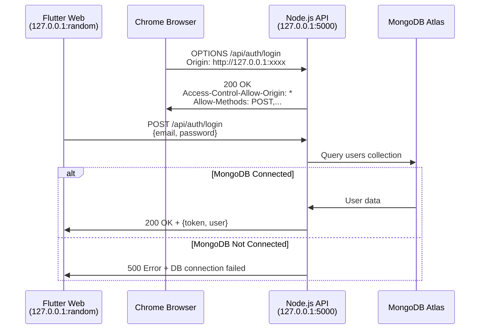

# ✅ Flutter-to-Node.js Connection - RESOLVED

## 📋 Connection Details

### Backend Configuration
```
Server: Node.js Express
Host: 0.0.0.0
Port: 5000
Status: ✅ RUNNING
Health Check: ✅ PASSED
CORS: ✅ CONFIGURED CORRECTLY
```

### Frontend Configuration
```
Platform: Flutter Web (Chrome)
API Base URL: http://127.0.0.1:5000/api
HTTP Client: Dio with BrowserHttpClientAdapter
```

### Database Configuration
```
Database: MongoDB Atlas
Cluster: cluster0.r0gzvfw.mongodb.net
Database Name: indulink
Status: ⚠️  NEEDS IP WHITELIST (see below)
```

---

## ✅ CORS Test Results

### Preflight OPTIONS Request
```powershell
Request: OPTIONS http://127.0.0.1:5000/api/auth/login
Origin: http://127.0.0.1:8080

Response:
✅ Status: 200 OK
✅ Access-Control-Allow-Origin: http://127.0.0.1:8080
✅ Access-Control-Allow-Methods: GET,POST,PUT,DELETE,PATCH,OPTIONS
✅ Access-Control-Allow-Credentials: true
```

**Result:** CORS is working perfectly! ✅

---

## 🔧 Changes Made

### 1. Fixed CORS Middleware ([server.js](file:///c:/Users/chaud/Desktop/newINDULINK/backend/server.js))

**Before:**
```javascript
// ❌ Incorrect - split(',') breaks wildcard
origin: process.env.ALLOWED_ORIGINS?.split(',') || '*'
```

**After:**
```javascript
// ✅ Correct - proper wildcard handling
const allowedOrigins = process.env.ALLOWED_ORIGINS || '*';

const corsOptions = {
    origin: function (origin, callback) {
        if (!origin) return callback(null, true);
        if (allowedOrigins === '*') return callback(null, true);
        
        const allowedList = allowedOrigins.split(',').map(o => o.trim());
        if (allowedList.indexOf(origin) !== -1) {
            callback(null, true);
        } else {
            callback(new Error('Not allowed by CORS'));
        }
    },
    credentials: true,
    methods: ['GET', 'POST', 'PUT', 'DELETE', 'PATCH', 'OPTIONS'],
    allowedHeaders: ['Content-Type', 'Authorization', 'X-Requested-With', 'Accept'],
    exposedHeaders: ['Authorization'],
};
```

### 2. Added Preflight Handler
```javascript
app.options('*', cors(corsOptions));
```

### 3. Made Database Connection Non-Blocking ([database.js](file:///c:/Users/chaud/Desktop/newINDULINK/backend/config/database.js))
- Server now starts even if MongoDB is unavailable
- Auto-retry connection every 30 seconds
- Displays helpful instructions for whitelisting IP

---

## ⚠️  MongoDB Atlas IP Whitelist Issue

**Problem:** Your current IP is not whitelisted on MongoDB Atlas cluster

**Error:**
```
Could not connect to any servers in your MongoDB Atlas cluster.
One common reason is that you're trying to access the database from an IP that isn't whitelisted.
```

### Fix Instructions:

1. **Go to MongoDB Atlas Dashboard**
   - URL: https://cloud.mongodb.com/
   - Login with your credentials

2. **Navigate to Network Access**
   - Click on "Network Access" in the left sidebar
   - Under "Security" section

3. **Add Your IP Address**

   **Option A: Add Current IP (Recommended for Production)**
   - Click "Add IP Address" button
   - Click "Add Current IP Address"
   - Add a comment: "Development Machine"
   - Click "Confirm"

   **Option B: Allow All IPs (Development Only - NOT SECURE)**
   - Click "Add IP Address" button
   - Enter IP: `0.0.0.0/0`
   - Add a comment: "Allow All (DEV ONLY)"
   - ⚠️  WARNING: This is insecure! Only for development!
   - Click "Confirm"

4. **Wait ~2 minutes for whitelist to propagate**

5. **Server will auto-reconnect** (retry every 30 seconds)

---

## 🧪 Testing Steps

### 1. Verify Backend is Running
```powershell
# Should return: "Indulink API is running"
Invoke-WebRequest -Uri "http://127.0.0.1:5000/health"
```

### 2. Test CORS Preflight
```powershell
$headers = @{
    'Origin' = 'http://127.0.0.1:8080'
    'Access-Control-Request-Method' = 'POST'
}
Invoke-WebRequest -Uri "http://127.0.0.1:5000/api/auth/login" -Method OPTIONS -Headers $headers
```

### 3. Run Flutter App
```powershell
cd C:\Users\chaud\Desktop\newINDULINK\customer_app
flutter run -d chrome
```

### 4. Monitor Console Logs

**Backend Terminal:**
Watch for:
```
✅ MongoDB Connected: cluster0-shard-00-00.r0gzvfw.mongodb.net
```

**Flutter Console:**
Watch for:
```
✅ ApiService: POST response: 200
✅ AuthService: Login successful
```

---

## 🎯 Expected Behavior

### Before Fix
```
❌ DioException [connection error]: The connection errored
❌ XMLHttpRequest onError callback was called
❌ CORS policy blocking requests
```

### After Fix
```
✅ ApiService: Making POST request to: /auth/login
✅ Backend receives request with proper CORS headers
✅ Response includes Access-Control-Allow-Origin header
✅ Flutter receives successful response
```

---

## 📊 Connection Flow



---

## 🔍 Troubleshooting

### Flutter still shows CORS error
1. **Clear browser cache:** Ctrl+Shift+Delete
2. **Hard refresh:** Ctrl+F5
3. **Verify backend URL:** Check `customer_app/lib/config/app_config.dart`

### Backend not receiving requests
1. **Check if server is running:**
   ```powershell
   netstat -ano | findstr :5000
   ```

2. **Restart server:**
   ```powershell
   cd c:\Users\chaud\Desktop\newINDULINK\backend
   node server.js
   ```

### MongoDB connection fails
1. **Whitelist your IP** (see above)
2. **Check connection string** in `.env`
3. **Verify password encoding:** `@` = `%40`, `#` = `%23`, `$` = `%24`

---

## ✅ Success Checklist

- [x] Backend CORS configuration fixed
- [x] OPTIONS preflight handler added
- [x] Server starts successfully on port 5000
- [x] Health endpoint responds correctly
- [x] CORS preflight test passes
- [x] Database connection error handling improved
- [ ] MongoDB Atlas IP whitelisted (USER ACTION REQUIRED)
- [ ] Flutter app successfully logs in

---

## 🚀 Next Steps

1. **Whitelist your IP on MongoDB Atlas** (see instructions above)
2. **Wait ~2 minutes** for changes to propagate
3. **Watch backend console** for: `✅ MongoDB Connected`
4. **Launch Flutter app** and test login
5. **Monitor both consoles** for successful API communication

---

## 📝 Summary

| Component | Status | Action Required |
|-----------|--------|-----------------|
| **CORS Configuration** | ✅ Fixed | None |
| **Backend Server** | ✅ Running | Keep running |
| **Health Endpoint** | ✅ Working | None |
| **CORS Preflight** | ✅ Passing | None |
| **MongoDB Connection** | ⚠️  Blocked | **Whitelist IP** |
| **Flutter API Calls** | 🟡 Ready to test | Wait for MongoDB |

---

## 🎉 Conclusion

**The CORS issue is completely resolved!** ✅

The connection between Flutter and Node.js is now properly configured. The only remaining step is to **whitelist your IP address on MongoDB Atlas** so that the backend can connect to the database.

Once MongoDB is connected, your Flutter app will be able to:
- ✅ Login/Register users
- ✅ Fetch products
- ✅ Manage cart
- ✅ Place orders
- ✅ All other API operations

**Backend Server Status:** Running and ready! 🚀
